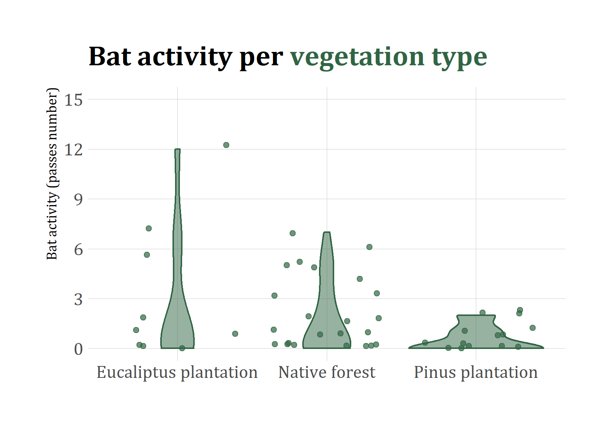

```{r setup, include=FALSE}
knitr::opts_chunk$set(echo = FALSE,
                      message = FALSE,
                      warning = FALSE,
                      cache = TRUE)
```


```{r, echo=FALSE, include=FALSE}

library(tidyverse)
library(skimr)
library(janitor)
library(hrbrthemes)
library(ggtext)
library(ragg) 
library(systemfonts)
library(extrafont)
loadfonts() #I am working on windows so I am using those to be sure everything is working on
# fonts()
```

class: center

# Presentation

This report presents the preliminary results of the summer study to assess the bat community's richness and activity in the area of influence of the project *Parque Eólico San Rafael, Región del Maule* Region VII in Central Chile.


---
class: left, middle

# Introduction

Since establishing the new environmental regulations, bat fauna has been considered a relevant element in the Environmental Impact Assessment. Even more in projects with potential detrimental to this faunal element, such as wind turbines. Recent literature points out that bats would be affected by wind turbines due to their directional echolocation system, which would prevent them from detecting a moving blade. Even more, edges don't need to hit bats directly, but they could cause barotrauma because of them. Additionally, certain bats species may feel attraction for wind turbines because they consider them a potential refuge (Kuntz et al., 2007; Horn et al., 2008; Escobar et al., 2015).]

---


```{r, include = TRUE}
Batactivity <- read_csv("data/DataBase.csv", 
                        col_types = list(Hour_activity = col_character())) %>% 
  clean_names()

Batactivity <- Batactivity %>% 
  mutate(watercourses = as.logical(watercourses)) 
  
  
```


```{r, include = TRUE, echo=FALSE, warning=FALSE}
Bat_hour_activity <- Batactivity %>% 
  rename(hour_activity_fct = hour_activity) %>% 
  mutate(hour_activity_int = as.integer(hour_activity_fct)) %>% 
  mutate(hour_activity_fct = fct_reorder(hour_activity_fct, hour_activity_int))

theme_bat <- function() {
  theme_ipsum(base_family = "Cambria") +
  theme(axis.title = element_blank(),
        panel.grid.minor.y = element_blank(),
        plot.title = element_markdown(face="bold"))
}

gg_bat_activity <- ggplot(data=Bat_hour_activity,
       mapping = aes(x = hour_activity_fct,
                     y = bat_passes_number)) +
  geom_violin(show.legend = FALSE,
              color="#4A738D",
              fill = "#4A738D",
              alpha=0.5) +
  geom_jitter(alpha=0.7, show.legend = FALSE,
              color = "#4A738D") +
  scale_y_continuous(limits = c(0,15),
                     breaks = seq(from=0, to=15, by=3)) +
  labs(title = "Bat activity per <span style = 'color:#4A738D'>hour at night</span>",
       x="",
       y= "Bat activity (passes number)") +
   
  theme_bat()
```

```{r, out.width='450', fig.align='center'}
ggsave(filename = "plots/bat-activity-plot.png",
       gg_bat_activity,
       height = 4,
       width = 5.5)


```

```{r}
Bat_vegetation_activity <- Batactivity %>% 
  select(bat_passes_number, vegetation_type) %>%
  mutate(vegetation_type = case_when(
    vegetation_type == "Native_forest" ~ "Native forest",
    vegetation_type == "Tree_plantation" ~ "Pinus plantation",
    vegetation_type == "Tree_plantation_arbustive" ~ "Eucaliptus plantation"
  ))
  
gg_bat_vegetation <- ggplot(data=Bat_vegetation_activity,
       mapping = aes(x = vegetation_type,
                     y = bat_passes_number)) +
  geom_violin(show.legend = FALSE,
              color="#316544",
              fill = "#316544",
              alpha=0.5) +
  geom_jitter(alpha=0.7, show.legend = FALSE,
              color = "#316544") +
  scale_y_continuous(limits = c(0,15),
                     breaks = seq(from=0, to=15, by=3)) +
  labs(title = "Bat activity per <span style = 'color:#316544'>vegetation type</span>",
       x="",
       y= "Bat activity (passes number)") +
   
  theme_bat()
```


```{r, out.width='450', fig.align='center'}
ggsave(filename = "plots/bat-vegetation-plot.png",
       gg_bat_vegetation,
       height = 4,
       width = 5.5)


```
